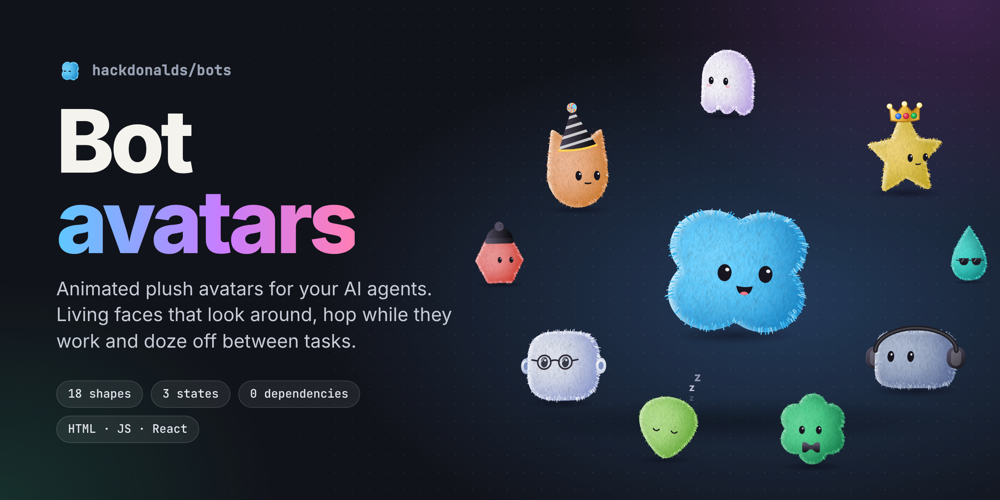
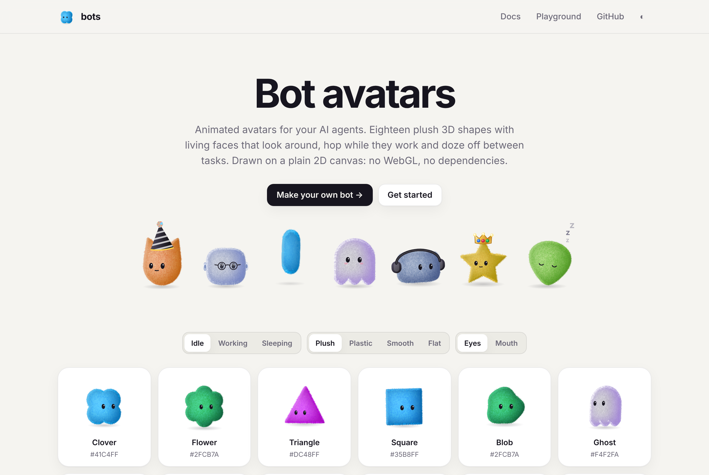
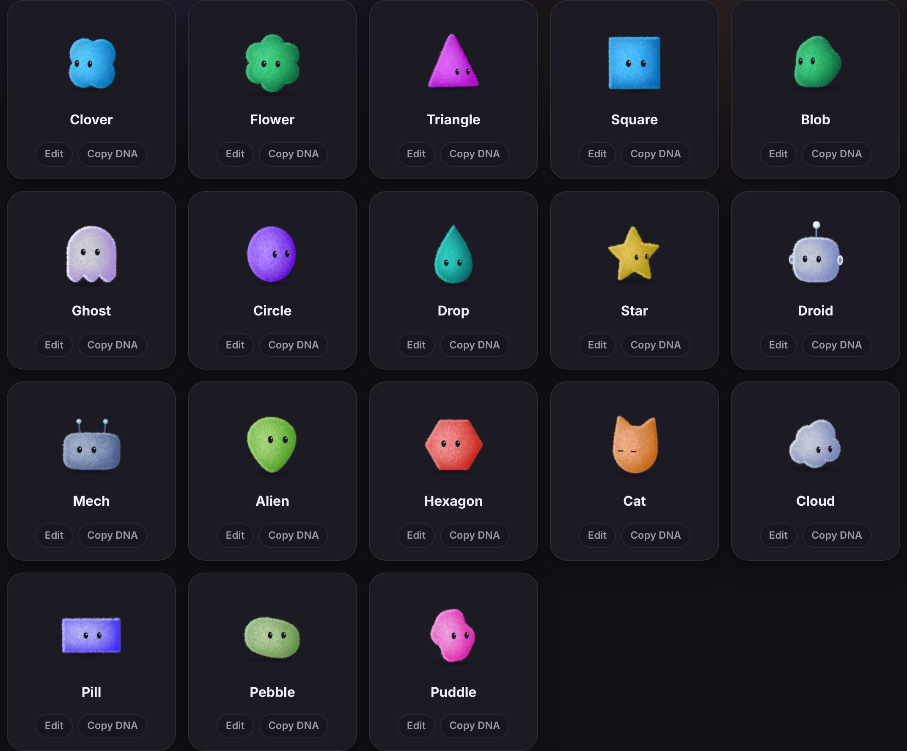
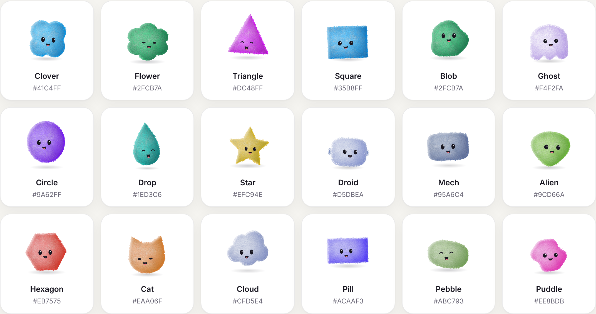
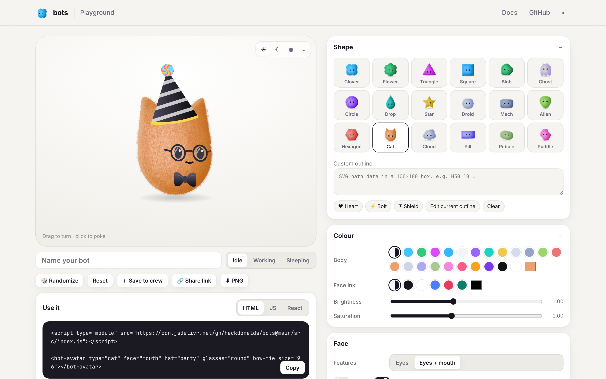

<p align="center"></p>

# bots

Animated bot avatars for AI agents. Eighteen plush 3D shapes, each with a temperament of its own, with living faces that look around, hop while they work and doze off between tasks — plus hats, glasses, headphones and bow ties, glass and lantern materials, and quirks. Tell one what your agent is doing with `bot.observe()` and it works out the rest. Drawn with WebGL in worker threads, with a plain 2D canvas fallback wherever either is missing: no build step, no dependencies.

**[Live site](https://kucukkanat.github.io/bots/) · [Docs](https://kucukkanat.github.io/bots/docs/) · [Studio](https://kucukkanat.github.io/bots/playground/)** — installable as an app, and works offline after the first visit.

<p align="center"></p>

A from-scratch, framework-agnostic homage to [bot-avatars](https://libraries.dev/bots) by Jakub Antalik (MIT; the type palette follows it).

## Shapes

All eighteen types, idle with eyes (left) and working with a mouth (right):

<p align="center">
  
  
</p>

## Install

```sh
npm i github:kucukkanat/bots#release
```

The `release` branch holds the built package (`dist/` plus the source), published by CI on every change to main; import it as `@kucukkanat/bots`. Pin a version with a commit of that branch: `github:kucukkanat/bots#<commit>`. No build step? Use the script tag below.

## Use it

### Custom element

```html
<script type="module" src="https://kucukkanat.github.io/bots/dist/bots.js"></script>

<bot-avatar type="clover" state="working" size="96"></bot-avatar>
<bot-avatar type="cat" face="mouth" hat="party" bow-tie></bot-avatar>
```

Every option is an attribute in kebab-case. Change an attribute and the avatar eases into the new look.

### JavaScript

```js
import { createBot } from 'https://kucukkanat.github.io/bots/dist/bots.js';

const bot = createBot('#agent', { type: 'droid', size: 96, glasses: 'round' });
bot.setState('working');   // 'default' (idle) | 'working' | 'sleeping'
bot.set({ hat: 'crown' }); // change anything
bot.poke();                // hop and turn round
bot.toDataURL();           // PNG of the current frame
bot.destroy();
```

### React

```jsx
import { BotAvatar } from '@kucukkanat/bots/react';

<BotAvatar type="clover" state={busy ? 'working' : 'default'} size={64} />
```

### Vue

```vue
<script setup>
import { ref } from 'vue';
import { BotAvatar } from '@kucukkanat/bots/vue';   // or app.use(BotAvatarPlugin) to register it globally
const avatar = ref(null);                           // avatar.value.bot is the controller
</script>

<template>
  <BotAvatar ref="avatar" type="cat" :state="busy ? 'working' : 'default'" :size="64" bow-tie
             :options="{ wear: { hat: 'party' } }" @poke="onPoke" @ready="(bot) => bot.react('joy')" />
</template>
```

Any option works as a prop (kebab or camel case), or all at once with `:options`. Events: `ready`, `poke`, `blink`, `jump`, `land`, `state`. Use the PascalCase tag: `<bot-avatar>` is the custom element.

### Svelte

```svelte
<script>
  import { bot } from '@kucukkanat/bots/svelte';
  let state = 'default';
</script>

<div use:bot={{ type: 'cat', state, size: 64 }} on:bot-poke={() => (state = 'working')}></div>
<!-- Svelte 5: onbot-poke={…}. bot-ready's detail.bot (and node.bot) is the controller. -->
```

An action, so it works in Svelte 4 and 5 with no compile step. The avatar's events bubble as `bot-poke`, `bot-blink`, `bot-jump`, `bot-land` and `bot-state`.

## Options

Dress it with one list: `wear="party-hat round-glasses bow-tie"`. Each thing has a spot (head, eyes, ears, neck, chest) that holds one, and `wear-color` colours them all; `wearables()` lists everything, including hats from packs. Ears and antennae are parts of the body: `ears="cat"`, `antennae="two"`. The options below set the same things one by one.

| Option | Values | Default |
| --- | --- | --- |
| `type` | clover, flower, triangle, square, blob, ghost, circle, drop, star, droid, mech, alien, hexagon, cat, cloud, pill, pebble, puddle | `clover` |
| `state` | `default` (idle), `working`, `sleeping` | `default` |
| `face` | `eyes`, `mouth` | `eyes` |
| `size` | px | `64` |
| `path` | SVG path data in a 100×100 box centred on (50, 50) — your own outline | — |
| `color`, `ink` | body colour, face colour | type's own, auto |
| `brightness`, `saturation` | 0–2 | `1` |
| `shading` | `fabric` (plush fur), `plastic`, `smooth`, `crisp`, `flat`, `glass`, `lantern` | `fabric` |
| `quirk` | imperfections: `patch`, `cowlick`, `scuff`, `stitches` (one or more) | — |
| `temperament` | `auto` (the type's own), a name (see below), `none` | `auto` |
| `light` | degrees clockwise from the top | `295` |
| `shadow`, `highlight`, `rim` | 0–2 | per shading |
| `spread`, `depth` | how far the light wraps; thickness when turned | `1.4`, `0.65` |
| `furLength`, `furDensity`, `furFuzz`, `furCurl`, `furGravity` | fabric pile | `1`, `1.6`, `0.9`, `0.7`, `0.9` |
| `hat` | `none`, `beanie`, `party`, `crown`, `beret`, `tophat` | `none` |
| `glasses` | `none`, `round`, `square`, `shades` | `none` |
| `headphones`, `bowTie`, `blush` | boolean | `false` |
| `accessoryColor` | colour of hats, headphones, bow tie | soft black |
| `eyeSize`, `eyeGap`, `faceScale`, `eyeShine` | face tweaks | `1`, `1`, `1`, `true` |
| `speed`, `turn`, `jumpEvery` | animation speed, how far it looks round, seconds between idle jumps (0 = never) | `1`, `1`, `8` |
| `paused`, `pose` | freeze; hold a pose such as `{ yaw: 0.8 }` | `false` |
| `interactive` | eyes follow the pointer, click to hop | `true` |
| `seed` | 0–1, offsets blinks and glances | random |
| `renderer` | `auto` (WebGL when there's a hardware GPU), `canvas` (always 2D) | `auto` |
| `quality` | `auto` (2D only: trades a little detail for speed, see below), `high` | `auto` |

`prefers-reduced-motion` shows each state's still pose. All avatars share one animation loop and pause when off screen.

## Advanced

Everything below is optional: leave it out and the avatar looks, moves and costs exactly what it did. Most of it is resolved once, before drawing (presets, Bot DNA, ids, colours, fur patterns are baked into the fur texture), so turning it on costs nothing per frame; the rest (brows, trails, audio) costs only while it's showing.

### Character

Every shape has a **temperament**: motion defaults (how often it glances, blinks and hops, how it breathes), a lean on its resting face, and habits. The cat is *aloof* and ignores the pointer now and then to look the other way; the ghost is *shy* and ducks and blushes when poked instead of hopping; the cloud is *dreamy* and floats, bobbing above the ground; the droid is *precise*, blinks in a snap and powers down square and still to sleep; the star is a *show-off* and spins twice. `temperament: 'nervous'` gives any shape another one (`eager`, `sunny`, `sharp`, `stoic`, `wobbly`, `shy`, `calm`, `nervous`, `showOff`, `precise`, `steady`, `curious`, `serious`, `aloof`, `dreamy`, `chipper`, `sleepy`), `'none'` a blank slate, and any motion option you set wins over it.

States change the body, not just the face: thinking stands tall, listening leans in, error slumps wider, sleeping flattens out.

**Quirks** are imperfections that make it someone: `quirk="patch cowlick"` sews a patch of other cloth low on one side (`patchColor`), stands a tuft up on the crown that sways and won't lie down, `scuff` wears a spot thin, `stitches` runs a seam down the body. The `ragdoll` preset is felt with a seam and a patch.

**Materials**: `shading: 'glass'` is see-through (`opacity`), with light pooling on the side away from the key, a Fresnel rim all round and two window reflections; `shading: 'lantern'` is lit from within (`glow`, `glowColor`), breathing slowly and flaring whenever it thinks, talks or laughs, with its halo spilling out around the body. Both are presets too.

### Grouped options and presets

Flat options and grouped objects are interchangeable; groups are easier to read and write:

```js
createBot('#agent', {
  type: 'cat',
  preset: 'teddy',                      // plush, teddy, velvet, mohair, felt, vinyl, clay, sticker, paper, glass, lantern, ragdoll
  fur: { length: 1.6, clumps: 0.6, pattern: 'stripes', color: '#8b5a2b', scale: 1.2 },
  light: { angle: 290, color: '#ffe7b3', fill: '#4c6fff', fillStrength: 0.4, rimColor: '#7ad7ff' },
  material: { roundness: 0.8, gloss: 0.4 },
  face: { eyes: { style: 'oval', iris: '#3b82f6' }, brows: 'soft', mouth: 'cat', freckles: true, expression: 'smug' },
  motion: { blinkRate: 1.4, breathing: 1.5, jiggle: 1, whirl: 1, jump: { height: 0.5, spin: 2, squash: 1.3, lean: 1.5 } },
  wear: { hat: 'witch', ears: 'bunny', scarf: true, badge: 'AI', antennae: 'two' },
});
```

In HTML, groups take JSON: `<bot-avatar fur='{"pattern":"spots"}'>` (the face group is `face-options`, since `face` is the eyes/mouth switch), and every flat option has its kebab-case attribute.

| Group | Options |
| --- | --- |
| `fur` | `length`, `density`, `fuzz`, `curl`, `gravity`, `clumps`, `pattern` (`none`, `two-tone`, `gradient`, `tips`, `spots`, `stripes`, `belly`, `patches`), `color` (second colour), `scale` |
| `light` | `angle`, `color` (key light), `fill` (shade-side tint) and `fillStrength`, `rimColor`, `shadow`, `highlight`, `rim`, `spread` |
| `material` | `shading`, `roundness` (1 a pillow, 0 a slab), `gloss`, `depth`, `glow`, `glowColor`, `quirk` |
| `face` | `features` (`eyes`/`mouth`), `eyes: { style, size, gap, shine, iris }`, `brows` (`auto`, `none`, `soft`, `thick`, `line`), `mouth` (`smile`, `cat`, `line`, `o`, `teeth`, `tongue`), `freckles`, `x`, `y`, `scale`, `blush`, `blushColor`, `ink`, `expression` |
| `motion` | `speed`, `turn`, `blinkRate`, `glanceRate`, `breathing`, `jiggle`, `whirl`, `whirlColor`, `jump: { every, height, time, spin, squash, stretch, lean }` |
| `wear` | a list (`'party-hat round-glasses bow-tie'`, or an array), or `hat` (`beanie`, `party`, `crown`, `beret`, `tophat`, `cap`, `witch`, `halo`, `bow`, or your own), `glasses`, `headphones`, `bowTie`, `color`, `scarf`, `scarfColor`, `badge` (up to 3 characters), `badgeColor`, `ears` (`cat`, `bunny`, `bear`, `round`), `antennae` (`auto`, `none`, `one`, `two`), `accessories` |

Eye styles: `round`, `oval`, `wide`, `dot`, `sleepy`, `happy`, `line`, `star`, `heart`.

### Agent states, expressions and voice

States for agents: `default` (idle), `working`, `sleeping`, `listening`, `thinking` (with a thought bubble), `speaking`, `error`, `success`.

```js
bot.setState('thinking');
bot.react('surprised');            // a moment's expression over any state:
                                   // happy, joy, surprised, worried, sad, angry, smug, sleepy, confused, dizzy, love
bot.speak(mediaStream);            // mouth follows a mic, an <audio>/<video> element or a Web Audio node
bot.speak();                       // stop, back to the previous state
bot.setVoice(0.6);                 // or drive the mouth yourself (e.g. from TTS visemes); null = made-up chatter
bot.lookAt(document.querySelector('#chat-input'));   // keep an eye on an element (or { x, y })
```

`expression` holds a face (`expression: 'smug'`) and also takes an object of channels: `brow`, `browTilt`, `eyeWide`, `squint`, `smile` (−1 frown … 1), `mouthOpen`, `happy`, `dizzy`, `blushPulse`.

### Events

```js
bot.on('land', () => playThud());      // 'poke', 'blink', 'jump', 'land', 'state', 'say-start', 'say-end', 'mood'
el.addEventListener('bot-blink', …);   // the same, as bubbling DOM events
```

### Bot DNA and looks from ids

```js
const code = bot.dna;                         // 'bot1.…' — the whole design in a short string
createBot('#copy', { dna: code });            // the same bot again
createBot('#user', { identity: user.email }); // a stable bot of its own for every id
```

### Your own shapes, hats, states and images

```js
import { registerShape, registerHat, registerState } from '…/src/index.js';
registerShape('bean', { path: 'M50 8C80 8 92 40 86 62C80 86 60 94 46 92C22 88 8 66 12 40C16 18 30 8 50 8Z', color: '#c58b5a' });
registerHat('fez', { layers: [{ d: 'M28 100L34 40H66L72 100Z', fill: '#c0392b' }, { d: 'M50 40C52 30 60 26 64 30', stroke: '#222', lineWidth: 3 }] });
registerState('dance', { duration: 1.2, keyframes: [{ at: 0, pose: { roll: -0.2 } }, { at: 0.6, pose: { roll: 0.2, y: -0.15, happy: 1 } }, { at: 1.2, pose: { roll: -0.2 } }] });
createBot('#x', { type: 'bean', hat: 'fez', state: 'dance',
  accessories: [{ src: '/logo.png', x: 0.45, y: 0.4, size: 0.2 }] });   // images pinned to the body, turning with it
```

### Export

```js
const gif = await bot.export({ format: 'gif', duration: 2.4, fps: 20 });   // also 'apng', 'webm', 'sprite', 'png', 'webp'
```

Frames are rendered offline from a copy of the avatar's simulation; the exporter loads on first use.

#### Stickers

```js
const sticker = await bot.export({ format: 'sticker' });   // 512px PNG, die-cut white outline

import { exportStickers } from '@kucukkanat/bots/export';
const zip = await exportStickers([bot, { type: 'cat', hat: 'party' }, 'bot1.WzAsInN0YXIiXQ'], { outline: true });
```

A pack is a ZIP of transparent PNGs (`01-cat.png`, … named from `label` or `type`) and a `crew.json` with each design's DNA. Designs can be options, live avatars or DNA codes. Options: `size` (512), `outline` (`true` for white, or a colour), `outlineWidth`, `shadow`, `background`, `format: 'webp'`, and `frames: true` for animated (APNG) stickers.

### Theming with CSS

`<bot-avatar>` reads `--bot-color`, `--bot-ink`, `--bot-accessory-color`, `--bot-blush-color`, `--bot-fur-color`, `--bot-light-color`, `--bot-fill-color`, `--bot-rim-color` and `--bot-iris-color` where no attribute sets them; call `el.refresh()` after changing them.

## Agent features

Each loads on first use (a small module of its own); left off, they cost nothing.

### Let it understand the agent

```js
const bot = createBot('#agent', { type: 'clover', status: 'auto', affect: true });
input.oninput = () => bot.observe('typing', { target: input });   // listens, eyes on the box
bot.observe('sent');                                               // thinks; frets if the first token is slow
for await (const chunk of stream) bot.observe('token', { text: chunk });   // says it, reacts to its tone
bot.observe('tool', { name: 'search' }); bot.observe('tool-end');  // works, then back to thinking
bot.observe('done');                                               // waits for the mouth, then a happy hop
bot.observe('error', { message });                                 // worried; sheepish after three in a minute
```

`observe()` is the whole integration for most chat UIs: it picks the states, the gaze, the reactions and the lip-sync from what the agent is doing, and `setState()`, `react()` and `lookAt()` still work over the top. With `affect: true` it also dozes off after two minutes of nothing (`affect: { sleepAfter: 60 }`); `affect: { tone: false }` stops the reactions to the reply's tone. `announce: true` reads each change of state to screen readers ("Clover is thinking").

### The rest, by hand

```js
// Lip-sync from text, no audio: vowels open, m/b/p close, punctuation pauses.
await bot.say('Hello! How can I help?', { wpm: 165 });  // speaking state, then back
bot.say('Something else');                              // replaces what's being said
bot.say('');                                            // stop

// Streaming (LLM tokens): queue chunks onto the same utterance.
for await (const token of stream) bot.say(token, { append: true });
// When speech catches up with the stream it waits 0.8s for more before it ends.
bot.on('say-end', (e) => e.interrupted);                // also 'say-start'

createBot('#a', { status: 'typing' });  // 'none' | 'typing' | 'loading' | 'done' | 'error' | 'auto'
createBot('#b', { status: 'auto' });    // working → spinner, thinking → typing dots, success → check (2s), error → !

createBot('#c', { mood: 'auto' });      // or 'neutral' | 'happy' | 'excited' | 'calm' | 'sleepy' | 'grumpy'
bot.mood;                               // { name: 'happy', energy: 0.7 }
bot.on('mood', (e) => console.log(e.mood, e.energy));

createBot('#d', { social: true });      // social bots glance at each other and react when one is poked
```

```html
<bot-avatar status="auto" mood="auto" social></bot-avatar>
<script>document.querySelector('bot-avatar').say('Hi there');</script>
```

- **status** badges sit by the top of the head (top-left while a thought bubble shows) and pop in and out; they're drawn the same way on WebGL and 2D.
- **mood** scales speed, blinking, breathing and how often the bot hops, and leans its smile, brows and squint. With `'auto'` an energy level (0–1) rises with pokes, speech and state changes and drains toward sleepy over a few idle minutes; a quick flurry of pokes makes it grumpy for a while.
- **social** never overrides your own `lookAt()` and the pointer always wins.
- React: `onSayStart`, `onSayEnd` and `onMood` props.

## Play

Three opt-in ways to touch the bots, each a small module that loads only when switched on:

```html
<bot-avatar type="cat" toss petting sounds="0.4"></bot-avatar>
```

```js
const bot = createBot('#me', { toss: true, petting: true, sounds: true });
bot.on('grab', () => {});                       // picked up
bot.on('toss', ({ vx, vy, speed }) => {});      // let go (body radii per second)
bot.on('pet', ({ contentment }) => {});         // contentment peaked
```

- **`toss`** — drag the bot: it stretches toward your hand and dangles as you move; let go and it's thrown, bounces off the edges of its own canvas, lands with a squash and walks home. A click without a drag still pokes. Touches that start on the bot drag it instead of scrolling the page (`touch-action: none` on its canvas while `toss` is on).
- **`petting`** — slow strokes over the bot build contentment: its eyes close happily, it blushes, leans into the stroke, and the fur ruffles along it and settles back. Fast swipes don't count.
- **`sounds`** — `true` or a volume `0`–`1`: a squeak on poke, a boing on jump, a whoosh on toss, a purr while petted, a blip on state changes. All synthesized with Web Audio (no files); the audio starts on the first click or key press, as browsers require.

### Seasonal packs

Side-effect imports that register more hats:

```js
import '@kucukkanat/bots/packs/halloween';   // 'pumpkin', 'devil', 'bat'
import '@kucukkanat/bots/packs/winter';      // 'santa', 'earmuffs', 'antlers'
import { pack } from '@kucukkanat/bots/packs/party';   // 'confetti', 'sombrero', 'propeller'
createBot('#x', { type: 'ghost', hat: 'pumpkin' });
pack.hats;    // the names it added; pack.looks has a few suggested looks
```

## Studio

<p align="center"></p>

[`/playground/`](https://kucukkanat.github.io/bots/playground/) is a studio for designing a bot: starters, shapes, colour, face, material, fur, things to wear (and seasonal packs), motion, and an Agent tab to try `say()`, states, status badges, moods and reactions. Every setting lives in the URL (share it), with undo and redo. The Code tab gives the snippet for HTML, JS, React, Vue or Svelte; export a PNG, GIF, APNG, WebM, sprite sheet or sticker; save a crew in your browser, share it as a crew page or **publish it to GitHub Pages**.

## How it renders

**Where.** Each avatar's canvas is handed to a worker thread (`OffscreenCanvas`), so drawing runs off the main thread and avatars spread over up to four cores; the page itself keeps its frame rate however many there are. A worker is only used once it has started and said so; without worker support (or for a canvas you pass in yourself) the same renderer runs on the main thread. Each worker has at most one batch of frames in flight, so a slow one draws less often instead of falling behind. `renderSettings.workers = false` turns workers off.

**WebGL.** With a hardware GPU, the body is drawn with WebGL2: the stacked silhouette rasterised once (multisampled), every light pass a GPU blur of it at its own scale (from the silhouette's mipmap, ~13 taps a pass), and one shader laying down body colour, fur skin, turn shading, light, highlights and edge fuzz, then the outline hairs as one batch of thin quads. Faces and things worn are painted on top in 2D. It matches the 2D renderer to within a fraction of a level per pixel. Software-emulated WebGL (no GPU, or a blocked one) is refused, a lost context falls back, and a thread whose GPU turns out too slow switches to 2D — so every browser gets the fastest path it really has.

**2D canvas.** The fallback, built to stay cheap with many avatars on a page:

- **Adaptive depth.** The body is its outline stacked through its depth, but only with as many slices as the turn needs: one when facing you, more (about 3 device pixels apart) as front and back pull apart.
- **No clips, no layers.** The body goes down first on the empty frame, so everything on it (fur, turn shading, light, face) is painted with `source-atop` and stays inside the silhouette without a clip; what sits behind it (fuzz, ears, antennae, floor shadow) follows with `destination-over`.
- **Deferred, reused light.** Inner shadow, occlusion, cushion falloff and rim are blurred in one small buffer (≈120–180 px), from a lighter copy of the silhouette, and stretched back over the crisp body in a single draw. Each avatar keeps its buffers between frames: a hop only shifts them, and they're re-lit only once the outline has changed by about a buffer pixel.
- **Baked plush.** The fur is baked once per shape into a grey skin in the body's own coordinates and blended with each body colour once (`overlay`, plus a touch of `multiply` on pale colours), then laid on with a plain draw, mapped with the turn so the pile stays on the surface. Overlay darkens and lightens without greying, so one bake serves every colour and the fur keeps the body's saturation; the skin is levelled to mid grey on average and drawn at constant strength, so it never shifts the body's colour as it turns. The skin is tens of thousands of hair-thin strands at device-pixel scale, painted in tiers (deep pile, body, tips), combed by a flow field (hair falls from a crown above the head, twisted into clumps by noise), with tips lit by a Kajiya–Kay fibre term so the nap shows soft sheen. A broad cushion falloff gives the volume, and the edge is a soft band of fuzz behind the silhouette with a dense fringe of fine strands, toned by the light.
- **Only draw what changed.** A frame is skipped when the pose has moved less than a quarter of a device pixel, so a resting avatar breathing in sub-pixel steps is mostly free. Off-screen and reduced-motion avatars don't animate.
- **Frame budget.** All avatars share one animation loop. When the page can't keep up, they take turns redrawing while their simulations keep real time, so the page keeps its frame rate.

- **Economies, 2D only.** With `quality: 'auto'` and no WebGL, light is re-computed after slightly larger movements, high-density screens draw at 1.5× instead of 2×, and avatars of 48px or less animate at half rate. With WebGL, or `quality: 'high'`, nothing is traded.

`/bench/grid.html?n=30&size=96` (with `npm start` running) renders a grid of avatars and reports the page's frame rate and each avatar's; `workers=off`, `renderer=canvas`, `quality=high` and `budget=off` compare the paths.

## Develop

```bash
npm test          # unit tests (Node 18+)
npm start         # serves the site at http://localhost:8000
```

`node docs/screenshots.mjs` (with `npm start` running and Playwright installed) regenerates the images in `docs/`; the hero poster is `docs/poster.html`.

Pushing to `main` runs the tests and deploys the site with GitHub Actions (`.github/workflows/pages.yml`). In the repository settings, set **Pages → Source** to **GitHub Actions**.

## License

MIT
